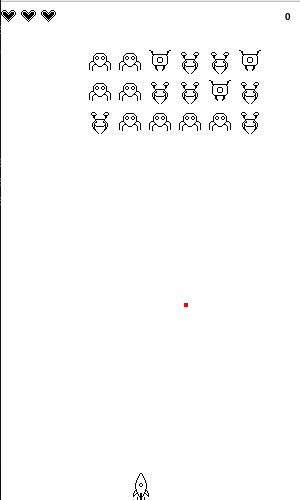

# 👾 Space Invader – Python + Pygame

Un mini-jeu inspiré du classique *Space Invaders*, réalisé en Python avec **Pygame**. Le joueur contrôle un vaisseau spatial et doit détruire les vagues d'ennemis tout en évitant leurs tirs.

---

## 🎮 Comment jouer

- **Flèche gauche / droite** : déplacer le vaisseau
- **Barre espace** : tirer un missile
- **Entrée** : recommencer la partie après un Game Over

### Objectif :
Détruire tous les ennemis tout en évitant leurs missiles. Vous perdez un point de vie à chaque impact. Le jeu redémarre quand tous les ennemis sont éliminés ou si le joueur perd tous ses PV.

---

## 🧰 Librairies utilisées

- [pygame](https://www.pygame.org/) – pour la création de la fenêtre, les graphismes et les contrôles clavier
- [random](https://docs.python.org/fr/3/library/random.html) – pour faire tirer les ennemis aléatoirement
- [sys, os] – pour la gestion du système

---

## 🖼️ Ressources graphiques

Les **sprites du joueur et ennemis** ont été créés à la main avec [Krita](https://krita.org/fr/), un logiciel libre de dessin numérique.

---

## 🛠️ Lancer le jeu

### 1. Installer les dépendances :
```bash
pip install pygame
```  
  
## 🎥 Aperçu du jeu


